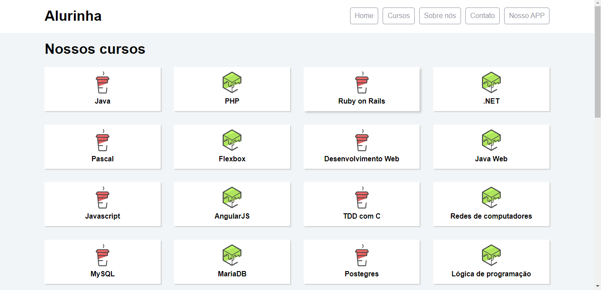
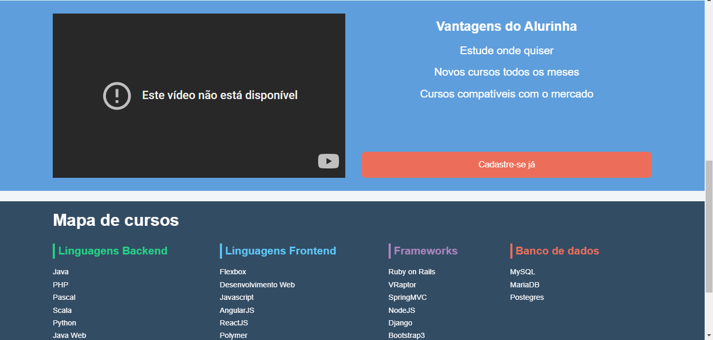

# Alura-Flexbox

One course provided by **Alura**, which has **Yuri Padilha** as an instructor: 
<a href="https://cursos.alura.com.br/course/posicione-elementos-com-flexbox" target="blank_"> Click here to Access </a>

# Site Preview
| 1° Image Preview | 2° Image Preview |
| -----------------|------------------|
| ||

> Sadly, the video was removed... 

# Course Concept 
In this course, the student will develop "Alurinha", Alura's new platform created to sell his technology courses, 
using only FLEXBOX to align its elements.

# Major Knowledges 
- CSS: Flexbox
